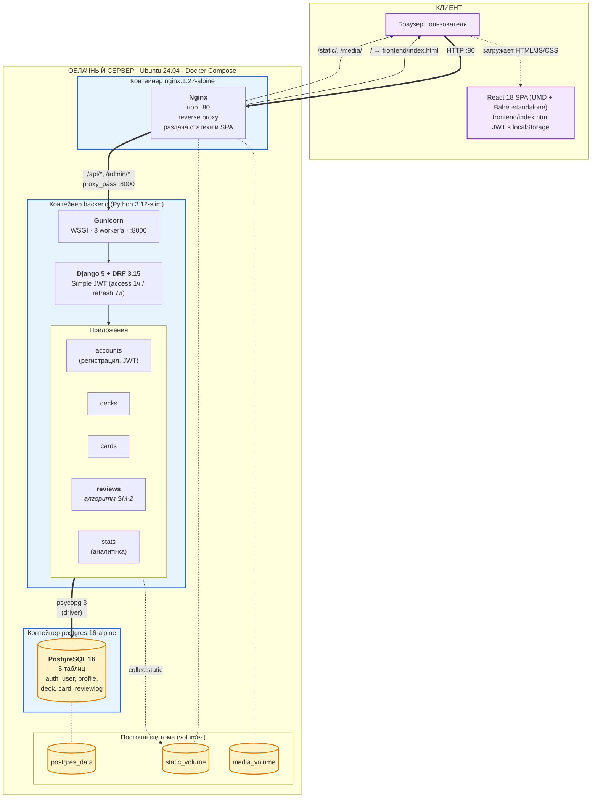

# Архитектура веб-приложения

Трёхзвенная архитектура: клиент (SPA) — сервер приложений (Django + Nginx) — СУБД (PostgreSQL).
Серверная часть упакована в Docker-контейнеры и оркестрируется Docker Compose.



## Поток типового запроса

**Загрузка приложения** (вход на сайт):
1. Браузер → `GET http://147.45.143.248/` → **Nginx**
2. Nginx отдаёт `frontend/index.html` (смонтирован как `:ro` volume)
3. Браузер качает React, ReactDOM, Babel с CDN и исполняет SPA

**API-запрос** (например, повторение карточки):
1. Браузер → `POST /api/review/answer/` с `Authorization: Bearer <JWT>` → **Nginx**
2. Nginx по правилу `location ~ ^/(api|admin)/` проксирует в `http://backend:8000`
3. **Gunicorn** передаёт запрос Django; **Simple JWT** валидирует токен
4. View вызывает `SM2Engine.process_review()` → пересчитывает `EF`, интервал, дату следующего показа
5. Запись `ReviewLog` сохраняется в **PostgreSQL** через psycopg
6. JSON-ответ возвращается обратно той же цепочкой

## Соответствие компонентов файлам проекта

| Компонент схемы          | В репозитории                                    |
|--------------------------|--------------------------------------------------|
| React SPA                | `frontend/index.html`, `frontend/App.jsx`        |
| Nginx-конфиг             | `nginx/nginx.conf`                               |
| Backend-образ            | `backend/Dockerfile`, `backend/entrypoint.sh`    |
| Django-настройки         | `backend/config/settings.py`                     |
| Маршрутизация API        | `backend/config/urls.py`, `backend/apps/*/urls.py` |
| Алгоритм SM-2            | `backend/apps/reviews/models.py` (`SM2Engine`)   |
| Оркестрация контейнеров  | `docker-compose.yml`                             |
| Переменные окружения     | `.env` (из шаблона `.env.example`)               |

## Используемые технологии

| Слой       | Технологии                                                    |
|------------|---------------------------------------------------------------|
| Frontend   | React 18, JavaScript (JSX через Babel-standalone), CSS-vars   |
| Backend    | Python 3.12, Django 5.0.6, Django REST Framework 3.15, Simple JWT 5.3, Gunicorn 22, psycopg 3 |
| СУБД       | PostgreSQL 16                                                 |
| Reverse proxy | Nginx 1.27                                                 |
| Инфраструктура | Docker Engine, Docker Compose, Ubuntu Server 24.04 LTS    |

## Как получить картинку для Word/ВКР

1. https://mermaid.live → вставить содержимое блока ```mermaid из этого файла
2. **Actions → Download PNG** (поднять масштаб через шестерёнку, иначе шрифт мелкий)
3. Вставить в Word
