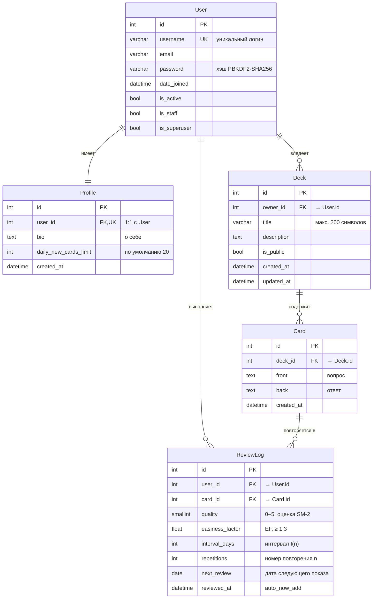

# ER-диаграмма базы данных

Схема построена по моделям Django (`backend/apps/*/models.py`).
Кардинальности используют нотацию «вороньей лапки» (Crow's Foot):
`||` — ровно один, `o{` — ноль или более, `o|` — ноль или один.



## Описание связей

| Связь                       | Кардинальность | Семантика |
|-----------------------------|----------------|-----------|
| User — Profile              | 1 : 1          | У каждого пользователя ровно один профиль (создаётся при регистрации). |
| User — Deck                 | 1 : N          | Пользователь владеет произвольным числом колод. При удалении пользователя колоды каскадно удаляются (`on_delete=CASCADE`). |
| Deck — Card                 | 1 : N          | Колода содержит карточки. Удаление колоды каскадно удаляет карточки. |
| User — ReviewLog            | 1 : N          | Один пользователь генерирует множество записей повторений. |
| Card — ReviewLog            | 1 : N          | Одна карточка имеет историю повторений (по одному ReviewLog на каждый ответ). |

## Индексы

- `ReviewLog(user, next_review)` — выборка карточек, которые сегодня нужно повторить.
- `ReviewLog(user, card, -reviewed_at)` — поиск последнего ответа пользователя по конкретной карточке (используется при расчёте новых параметров SM-2).
- `User.username` — уникальный (стандартный Django).
- `Profile.user` — уникальный (OneToOneField).

## Как получить картинку для Word/ВКР

1. Открой https://mermaid.live
2. Скопируй блок ```mermaid ... ``` из этого файла (только содержимое, без обёртки)
3. Слева вставь, справа увидишь диаграмму
4. **Actions → Download SVG/PNG** → вставляй в Word

Альтернатива — в VS Code установить расширение «Markdown Preview Mermaid Support», открыть этот файл, сделать скриншот превью.
